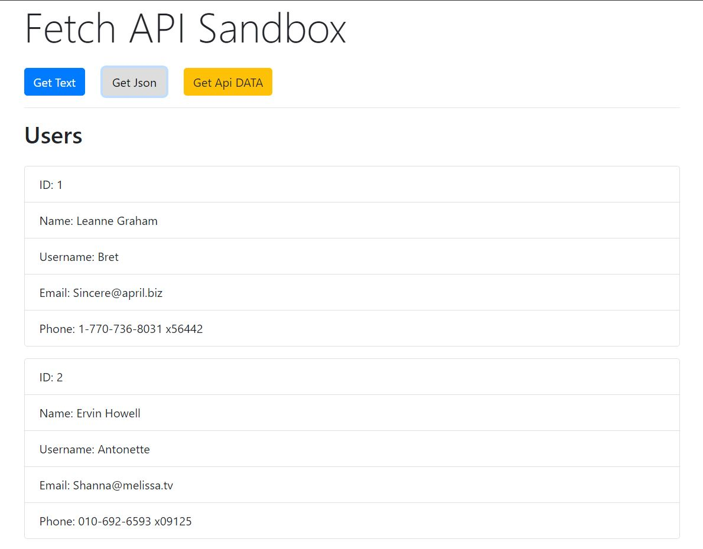
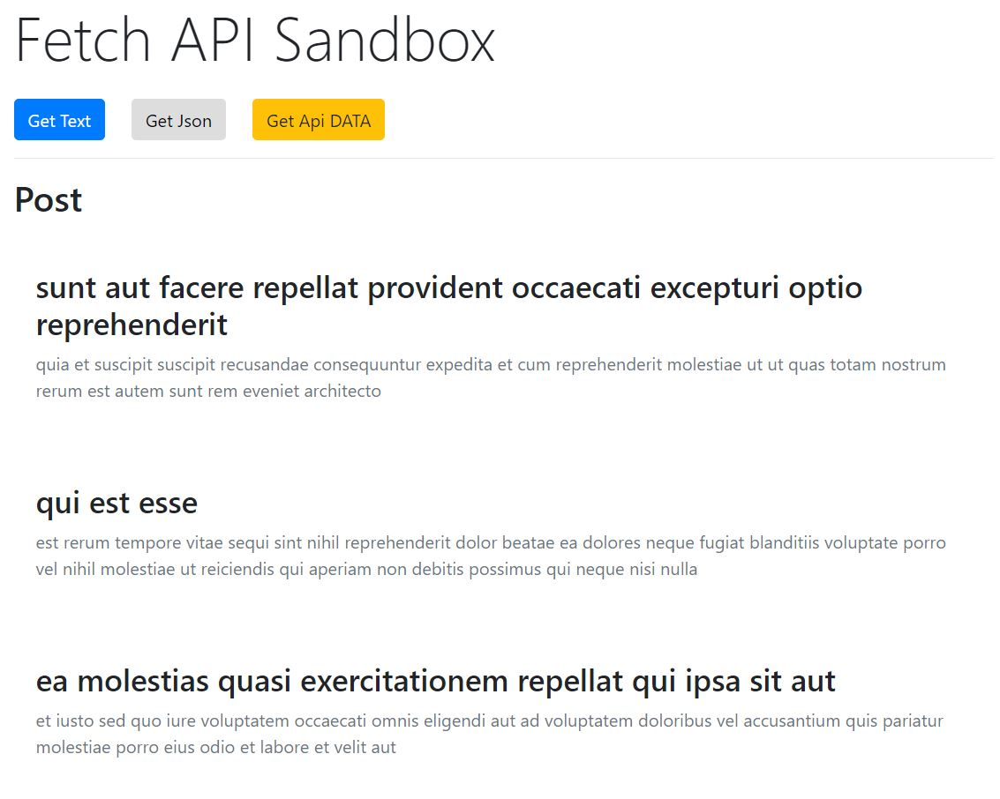

# Screenshots

# Fetch Method Exercises
> Praticing JavaScripts ES6 fetch methods variations

Followed a video tutorial by Traversy Media (https://youtu.be/Oive66jrwBs) to create a Fetch API Sanbox that used the fetch method to get local text data, json and API data and stringify post.

## Installing / Getting started

git clone https://github.com/Adrian609/Fetch-Method-Excercise.git
Open fetch.html in browser

## Development Enviroment
  * Visual Studio Code
  * JavaScript
  * JSON
  * Live Server
  * Twitter Bootstrap

## Features

Uses JavaScripts Fetch Method by:
* Fetching text files that are locally saved
* Fetching JSON files that are locally saved
* Fetching API's from URL
* Stringify simulated blog post inputed by a user

#### function getText() / getText2()
Type: `String`  
Default: `'sample.txt'`

getText() retrieves a sample.txt file and displays it in a div with an ID of output

#### function getUsers()
Type: `JSON`  
Default: users.json

getUser() retrieves user information from a URL or JSON and displays a users id, name, username, email and phone in a list.

#### function getPost()
Type: `JSON`  
Default: form input

getPost() retrieves the information entered by the user and converts it into and string using the stringify() method.

## Links

- Source: "Fetch API Introduction", Traversy Media https://youtu.be/Oive66jrwBs
- Repository: https://github.com/Adrian609/Fetch-Method-Excercise

## Licensing

"The code in this project is licensed under MIT license."
